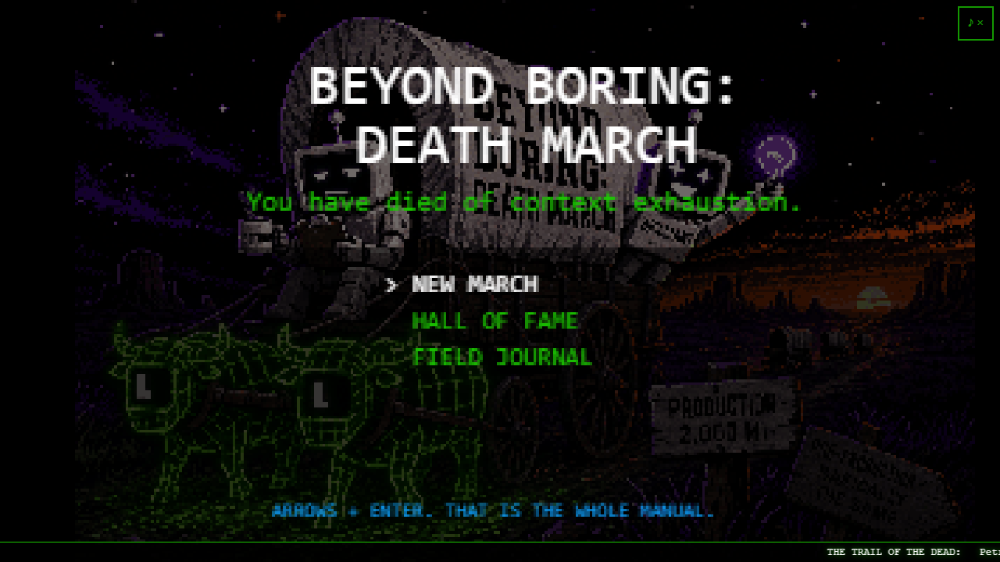
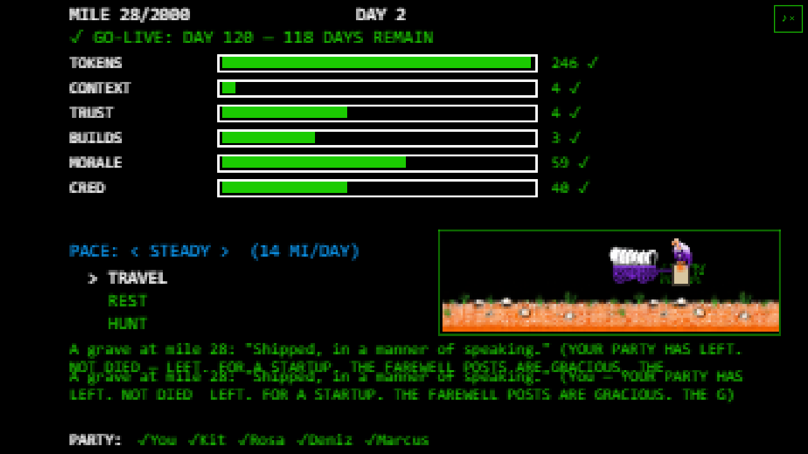
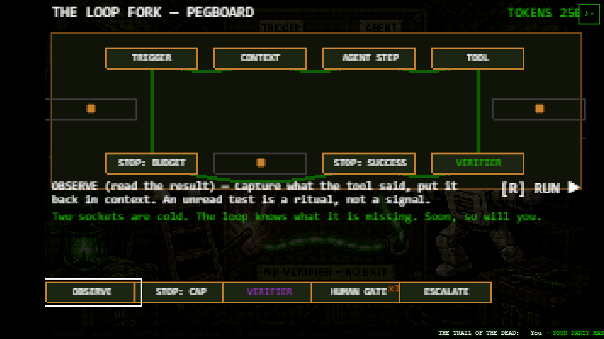
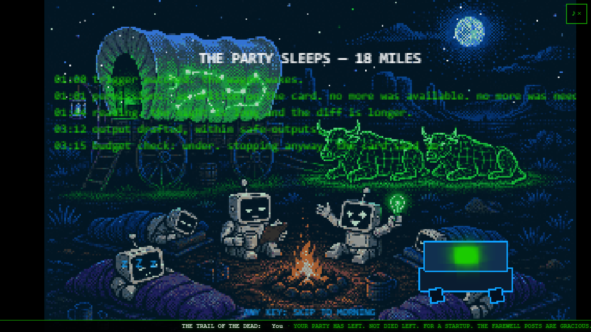
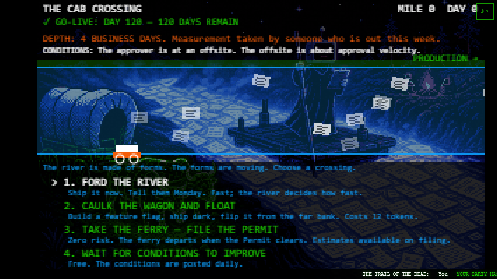
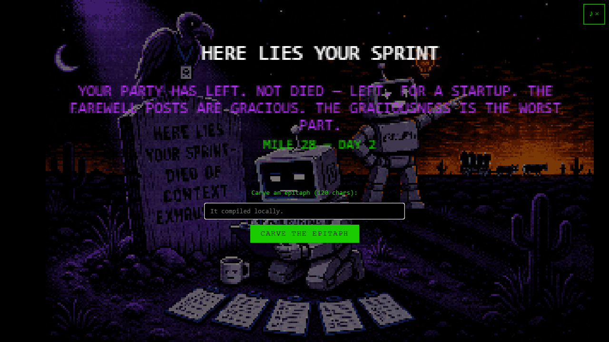

# BEYOND BORING: DEATH MARCH

*You have died of context exhaustion.*

An Oregon Trail parody about modern agentic engineering. You lead a party of
five out of **Legacy Junction** — a town whose primary industries are
quarterly planning and mandatory certificate rotation — toward **Production**,
a distant, semi-mythical territory where software is said to reach users in
the same fiscal quarter it was written. Nobody in Legacy Junction has been
there. Several people have been to Pre-Production, which they describe as
"basically the same," and which is not the same.

The trail is 2,000 miles of enterprise process. The wagon is a repository.
The oxen are agents. The dysentery is context exhaustion. The go-live date
was chosen at an offsite; it predates the estimate. You will not all make it.

**▶ Play it now: https://kolatts.github.io/beyond-boring-death-march/**



## What it teaches (by killing you)

Every mechanic maps to a real, current practice in agentic engineering. The
jokes land first; a plain-spoken **Field Note** card follows, with a link to a
primary source. Die enough times and you will have learned:

- **Agent = Model + Harness** — the Outfitting Store makes you draft them as
  two separate cards, then shows you the shakedown run.
- **Loop engineering** — the Loop Builder pegboard: trigger, context, agent,
  tool, observe, **verifier**, stop conditions. No verifier — no exit.
- **Context engineering** — the wagon has a weight limit and so does the
  window. Compaction is lossy. Subagents scout the 900-line log for you.
- **Verification** — a loop without a machine-checkable verifier is just an
  expensive infinite loop. Verifier Ridge is literally impassable without one.
- **Agentic workflows in CI** — the Night Watch: author a workflow card with
  YAML frontmatter, sleep, and wake up to whatever your permissions allowed.
- **Least privilege, safe outputs, budget caps** — the boring parts that keep
  you employed, taught by a raid, a recursive trigger, and a bill.

| | |
|---|---|
|  |  |
|  |  |

And when it goes wrong — it will — the tombstone takes an epitaph, the grave
persists onto your next run's trail (vulture included), and the death is
posted to a shared graveyard so other players can march past you too.



## Controls

Arrows + Enter. That is the whole manual.

(Also: `Esc` backs out, `M` toggles sound — muted by default, people play
this at work — number keys pick crossing options, and every screen is fully
keyboard-playable. On a phone, everything is tappable and the Bug Hunt grows
an on-screen D-pad.)

## Local development

```sh
npm install
npm run dev           # local dev server (Vite)
npm run build         # typecheck (strict) + production build
npm run lint:content  # validate all content JSON against schemas
```

Pushes to `main` build and deploy to GitHub Pages automatically
(`.github/workflows/deploy.yml`); content JSON is schema-linted in CI
(`content-lint.yml`).

## Architecture

Deliberately boring, which is the joke and also the point:

- **Static frontend** — [Phaser 3](https://phaser.io) + TypeScript + Vite,
  no framework, no state library. A 320×200 logical canvas upscaled with
  nearest-neighbour, letterboxed. DOM overlays (forms, field notes) sit above
  the canvas and talk to it over a tiny typed event bus (`src/ui/overlay.ts`).
- **One Azure Function** (`api/`, C#, consumption plan + Table Storage) —
  the only server anywhere. It stores the shared graveyard (death feed) and
  the hall of fame. The game degrades gracefully to `localStorage` when it is
  unreachable, so the frontend remains fully static and free to host.
- **Audio** is oscillator-only WebAudio (`src/systems/audio.ts`): zero
  asset bytes, muted by default, nothing touches an `AudioContext` until a
  user gesture and an explicit unmute.
- **Art** (`public/assets/art/`) loads lazily per scene — each scene's
  `preload()` fetches only its own images, keeping first load small.

Key directories:

```
src/scenes/     one Phaser scene per screen/minigame
src/systems/    game state, economy, event engine, sims, save, audio, art
src/content/    ALL prose and data — events, deaths, landmarks, NPCs, cards
src/schemas/    JSON Schema for every content file (CI-enforced)
src/ui/         DOM overlay, field-note cards, styles, touch helpers
api/            the graveyard Azure Function (C#)
docs/           curriculum reference, decisions log, art direction
```

## Editing the content (no TypeScript required)

Every event, death line, landmark blurb, NPC, curriculum card, and robot
argument lives in `src/content/*.json`, each validated by a matching schema
in `src/schemas/`. Edit the JSON, run `npm run lint:content`, open a PR.
Some places to start:

- `events.json` — the ~60 random events (add yours; keep the register:
  deadpan, present tense, never explain the joke, never name a real vendor)
- `deaths.json` — the tombstone lines
- `landmarks.json` / `npcs.json` — the twelve stops and their residents
- `boring-brilliant.json` — the two robots' advice; exactly one is right per
  landmark, marked in data, never in prose
- `curriculum.json` — the Field Notes; every card links a primary source
  (see `docs/CURRICULUM.md`)

Hard limits (see `prompt.md` §12): no real companies, no real vendors as
villains, no real people, never punch down. The bureaucracy is the target.

## Compliance

This repository is in full compliance with its own Mandatory Compliance
Notice, which nobody has read. The attestation button is at the top of
page one.

## Credits & licence

Built by Claude-driven agents from a build spec (`prompt.md`), art
direction v2 (`docs/ART-DIRECTION.md`), and a decisions log
(`docs/DECISIONS.md`). Palette: the six Apple II hi-res colours. Scoring
framework: the three-loops model — see the
[curriculum library](docs/CURRICULUM.md) for attribution. Tonal ancestor:
*The Oregon Trail* (MECC, 1985), memorialised with affection.

MIT — see [LICENSE](LICENSE). Go ship something.
